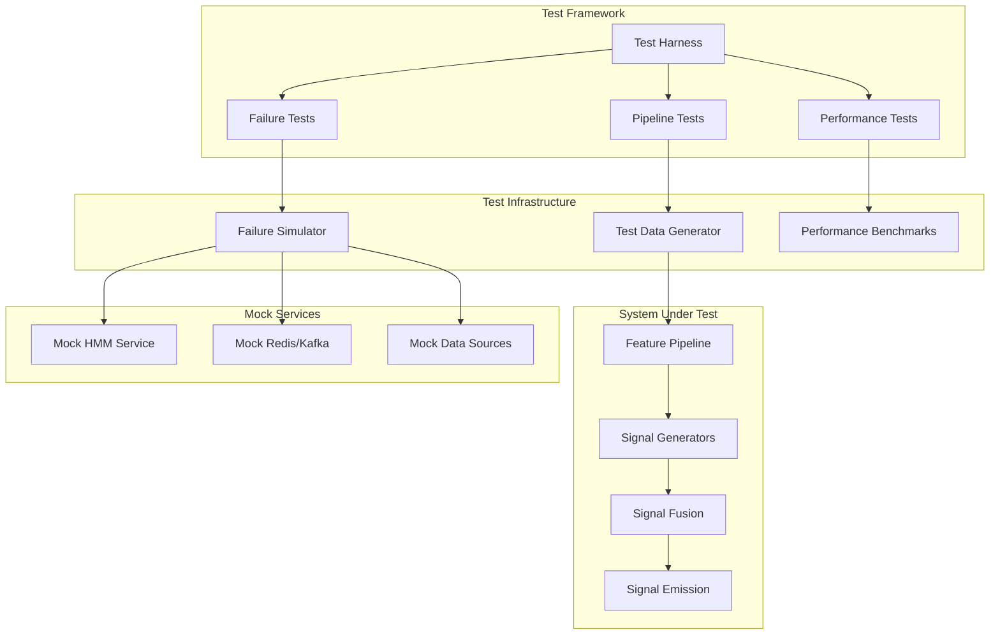
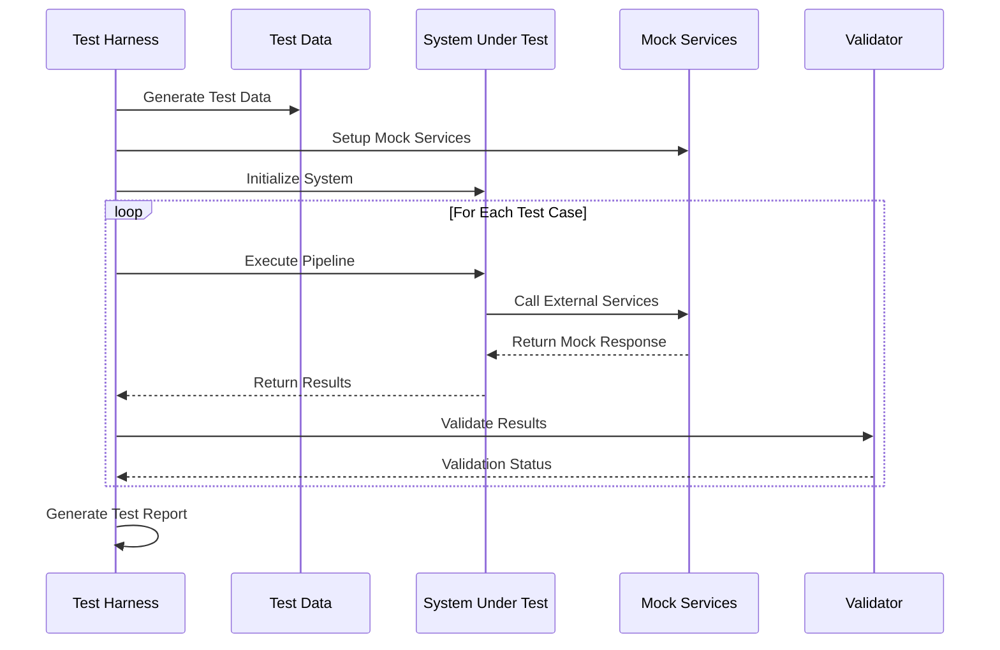

# End-to-End Testing Design Document

## Overview

The End-to-End Testing system provides comprehensive integration testing for the IMP trading system pipeline. It validates the complete signal generation flow from OHLCV data ingestion through signal emission, tests failure scenarios and fallback mechanisms, and ensures performance requirements are met.

## Architecture

### High-Level Testing Architecture



### Test Execution Flow



## Components and Interfaces

### 1. Test Harness (`TestHarness`)

**Responsibility**: Orchestrates test execution and manages test infrastructure.

```rust
pub struct TestHarness {
    config: TestConfig,
    data_generator: TestDataGenerator,
    failure_simulator: FailureSimulator,
    performance_monitor: PerformanceMonitor,
    validator: ResultValidator,
}

impl TestHarness {
    pub async fn new(config: TestConfig) -> Result<Self>;
    pub async fn run_pipeline_tests(&self) -> TestResults;
    pub async fn run_failure_tests(&self) -> TestResults;
    pub async fn run_performance_tests(&self) -> TestResults;
    pub async fn generate_report(&self, results: &[TestResults]) -> TestReport;
}
```

### 2. Test Data Generator (`TestDataGenerator`)

**Responsibility**: Generates realistic OHLCV data and market scenarios for testing.

```rust
pub struct TestDataGenerator {
    config: DataGenConfig,
    scenarios: Vec<MarketScenario>,
}

impl TestDataGenerator {
    pub fn new(config: DataGenConfig) -> Self;
    pub fn generate_ohlcv_data(&self, symbol: &str, duration: Duration) -> Vec<OHLCVBar>;
    pub fn generate_market_scenario(&self, scenario: MarketScenario) -> TestDataSet;
    pub fn generate_edge_cases(&self) -> Vec<TestDataSet>;
}

#[derive(Debug, Clone)]
pub enum MarketScenario {
    TrendingUp,
    TrendingDown,
    Sideways,
    HighVolatility,
    LowVolatility,
    GapUp,
    GapDown,
    FlashCrash,
}
```

### 3. Failure Simulator (`FailureSimulator`)

**Responsibility**: Simulates various failure conditions and service degradations.

```rust
pub struct FailureSimulator {
    hmm_service_mock: MockHMMService,
    redis_mock: MockRedisService,
    kafka_mock: MockKafkaService,
}

impl FailureSimulator {
    pub fn new() -> Self;
    pub async fn simulate_hmm_unavailable(&self) -> FailureContext;
    pub async fn simulate_redis_failure(&self) -> FailureContext;
    pub async fn simulate_kafka_failure(&self) -> FailureContext;
    pub async fn simulate_network_partition(&self) -> FailureContext;
    pub async fn simulate_data_corruption(&self) -> FailureContext;
}

#[derive(Debug)]
pub struct FailureContext {
    pub failure_type: FailureType,
    pub duration: Duration,
    pub recovery_behavior: RecoveryBehavior,
}
```

### 4. Performance Monitor (`PerformanceMonitor`)

**Responsibility**: Measures and validates system performance metrics.

```rust
pub struct PerformanceMonitor {
    metrics_collector: MetricsCollector,
    latency_tracker: LatencyTracker,
    throughput_monitor: ThroughputMonitor,
}

impl PerformanceMonitor {
    pub fn new() -> Self;
    pub fn start_measurement(&mut self, test_name: &str);
    pub fn record_latency(&mut self, operation: &str, latency: Duration);
    pub fn record_throughput(&mut self, operation: &str, count: u64, duration: Duration);
    pub fn get_performance_report(&self) -> PerformanceReport;
}

#[derive(Debug)]
pub struct PerformanceReport {
    pub end_to_end_latency: LatencyStats,
    pub feature_computation_latency: LatencyStats,
    pub signal_generation_latency: LatencyStats,
    pub signal_emission_latency: LatencyStats,
    pub throughput_stats: ThroughputStats,
    pub memory_usage: MemoryStats,
}
```

### 5. Result Validator (`ResultValidator`)

**Responsibility**: Validates test results against expected outcomes.

```rust
pub struct ResultValidator {
    reference_data: ReferenceDataSet,
    tolerance_config: ToleranceConfig,
}

impl ResultValidator {
    pub fn new(reference_data: ReferenceDataSet, tolerance: ToleranceConfig) -> Self;
    pub fn validate_features(&self, computed: &Features, expected: &Features) -> ValidationResult;
    pub fn validate_signals(&self, generated: &TradingSignal, expected: &TradingSignal) -> ValidationResult;
    pub fn validate_performance(&self, metrics: &PerformanceReport) -> ValidationResult;
    pub fn validate_fallback_behavior(&self, behavior: &FallbackBehavior) -> ValidationResult;
}
```

## Data Models

### Test Configuration

```rust
#[derive(Debug, Clone, Serialize, Deserialize)]
pub struct TestConfig {
    pub pipeline_tests: PipelineTestConfig,
    pub failure_tests: FailureTestConfig,
    pub performance_tests: PerformanceTestConfig,
    pub data_generation: DataGenConfig,
    pub validation: ValidationConfig,
}

#[derive(Debug, Clone, Serialize, Deserialize)]
pub struct PipelineTestConfig {
    pub test_symbols: Vec<String>,
    pub test_duration_hours: u32,
    pub data_interval: String, // "5m", "1h", etc.
    pub include_edge_cases: bool,
    pub validate_against_reference: bool,
}

#[derive(Debug, Clone, Serialize, Deserialize)]
pub struct FailureTestConfig {
    pub test_hmm_failures: bool,
    pub test_redis_failures: bool,
    pub test_kafka_failures: bool,
    pub test_data_corruption: bool,
    pub failure_duration_seconds: u64,
    pub recovery_timeout_seconds: u64,
}

#[derive(Debug, Clone, Serialize, Deserialize)]
pub struct PerformanceTestConfig {
    pub max_end_to_end_latency_ms: u64,
    pub min_throughput_signals_per_second: f64,
    pub max_memory_usage_mb: u64,
    pub concurrent_symbols: u32,
    pub test_duration_minutes: u32,
}
```

### Test Results

```rust
#[derive(Debug, Serialize, Deserialize)]
pub struct TestResults {
    pub test_suite: String,
    pub start_time: i64,
    pub end_time: i64,
    pub total_tests: u32,
    pub passed_tests: u32,
    pub failed_tests: u32,
    pub test_cases: Vec<TestCaseResult>,
    pub performance_metrics: Option<PerformanceReport>,
}

#[derive(Debug, Serialize, Deserialize)]
pub struct TestCaseResult {
    pub name: String,
    pub status: TestStatus,
    pub duration_ms: u64,
    pub error_message: Option<String>,
    pub metrics: HashMap<String, f64>,
    pub validation_details: Vec<ValidationDetail>,
}

#[derive(Debug, Serialize, Deserialize)]
pub enum TestStatus {
    Passed,
    Failed,
    Skipped,
    Timeout,
}
```

## Error Handling

### Test Framework Errors

```rust
#[derive(Debug, thiserror::Error)]
pub enum TestFrameworkError {
    #[error("Test setup failed: {0}")]
    SetupError(String),
    
    #[error("Test data generation failed: {0}")]
    DataGenerationError(String),
    
    #[error("System under test initialization failed: {0}")]
    SystemInitError(String),
    
    #[error("Test execution timeout after {timeout_ms}ms")]
    ExecutionTimeout { timeout_ms: u64 },
    
    #[error("Validation failed: {0}")]
    ValidationError(String),
    
    #[error("Performance requirement not met: {requirement}")]
    PerformanceError { requirement: String },
}
```

## Testing Strategy

### 1. Pipeline Integration Tests

**Complete Signal Flow Validation**
```rust
#[tokio::test]
async fn test_complete_signal_pipeline() {
    // Setup test data
    let test_data = generate_realistic_ohlcv_data("BTCUSDT", Duration::hours(24));
    
    // Initialize system
    let mut system = SignalPipeline::new(test_config()).await?;
    
    // Process data through complete pipeline
    let results = system.process_data(test_data).await?;
    
    // Validate results
    assert!(results.signals.len() > 0);
    assert!(results.end_to_end_latency < Duration::from_millis(100));
    validate_signal_quality(&results.signals)?;
}
```

**Feature Computation Accuracy**
```rust
#[tokio::test]
async fn test_feature_computation_accuracy() {
    let reference_data = load_reference_features("test_data/reference_features.json")?;
    let test_data = load_test_ohlcv("test_data/btcusdt_5m.parquet")?;
    
    let computed_features = compute_features(&test_data).await?;
    
    validate_features_against_reference(&computed_features, &reference_data, 0.001)?;
}
```

### 2. Failure Scenario Tests

**HMM Service Unavailability**
```rust
#[tokio::test]
async fn test_hmm_service_failure_fallback() {
    let mut system = SignalPipeline::new(test_config()).await?;
    
    // Simulate HMM service failure
    let failure_context = simulate_hmm_unavailable().await;
    
    // Process signals during failure
    let results = system.process_with_failure(test_data(), failure_context).await?;
    
    // Validate fallback behavior
    assert!(results.fallback_weights_used);
    assert!(results.signals.len() > 0);
    validate_fallback_signal_quality(&results.signals)?;
}
```

**Redis/Kafka Connection Failures**
```rust
#[tokio::test]
async fn test_signal_emission_failure_buffering() {
    let mut system = SignalPipeline::new(test_config()).await?;
    
    // Simulate Redis failure
    simulate_redis_failure().await;
    
    // Generate signals during failure
    let signals = generate_test_signals(10);
    for signal in signals {
        system.emit_signal(signal).await?;
    }
    
    // Validate local buffering
    assert_eq!(system.buffer_size(), 10);
    
    // Restore Redis and validate buffer flush
    restore_redis_connection().await;
    system.flush_buffer().await?;
    assert_eq!(system.buffer_size(), 0);
}
```

### 3. Performance Tests

**End-to-End Latency Validation**
```rust
#[tokio::test]
async fn test_end_to_end_latency_requirements() {
    let mut system = SignalPipeline::new(test_config()).await?;
    let test_data = generate_single_bar_data("BTCUSDT");
    
    let start_time = Instant::now();
    let result = system.process_single_bar(test_data).await?;
    let latency = start_time.elapsed();
    
    assert!(latency < Duration::from_millis(100), 
           "End-to-end latency {}ms exceeds 100ms requirement", 
           latency.as_millis());
}
```

**Concurrent Processing Performance**
```rust
#[tokio::test]
async fn test_concurrent_symbol_processing() {
    let symbols = vec!["BTCUSDT", "ETHUSDT", "ADAUSDT", "DOTUSDT", "LINKUSDT"];
    let mut handles = Vec::new();
    
    for symbol in symbols {
        let handle = tokio::spawn(async move {
            let mut system = SignalPipeline::new(test_config()).await?;
            let test_data = generate_test_data(symbol, Duration::hours(1));
            system.process_data(test_data).await
        });
        handles.push(handle);
    }
    
    let results = futures::future::join_all(handles).await;
    
    // Validate all symbols processed successfully
    for result in results {
        assert!(result.is_ok());
    }
}
```

## Configuration Management

### Test Configuration Files

```toml
# test_config.toml
[pipeline_tests]
test_symbols = ["BTCUSDT", "ETHUSDT"]
test_duration_hours = 24
data_interval = "5m"
include_edge_cases = true
validate_against_reference = true

[failure_tests]
test_hmm_failures = true
test_redis_failures = true
test_kafka_failures = true
test_data_corruption = true
failure_duration_seconds = 30
recovery_timeout_seconds = 60

[performance_tests]
max_end_to_end_latency_ms = 100
min_throughput_signals_per_second = 10.0
max_memory_usage_mb = 512
concurrent_symbols = 5
test_duration_minutes = 10

[data_generation]
market_scenarios = ["trending_up", "trending_down", "sideways", "high_volatility"]
include_gaps = true
include_outliers = true

[validation]
feature_tolerance = 0.001
signal_tolerance = 0.01
performance_tolerance = 0.1
```

## Monitoring and Reporting

### Test Report Generation

```rust
#[derive(Debug, Serialize)]
pub struct TestReport {
    pub summary: TestSummary,
    pub pipeline_results: TestResults,
    pub failure_results: TestResults,
    pub performance_results: TestResults,
    pub recommendations: Vec<String>,
    pub generated_at: i64,
}

#[derive(Debug, Serialize)]
pub struct TestSummary {
    pub total_duration_minutes: f64,
    pub overall_pass_rate: f64,
    pub critical_failures: u32,
    pub performance_violations: u32,
    pub system_health_score: f64,
}
```

### CI/CD Integration

```yaml
# .github/workflows/end-to-end-tests.yml
name: End-to-End Tests

on:
  push:
    branches: [main, develop]
  pull_request:
    branches: [main]

jobs:
  end-to-end-tests:
    runs-on: ubuntu-latest
    services:
      redis:
        image: redis:7
        ports:
          - 6379:6379
      kafka:
        image: confluentinc/cp-kafka:latest
        ports:
          - 9092:9092
    
    steps:
      - uses: actions/checkout@v3
      - name: Setup Rust
        uses: actions-rs/toolchain@v1
        with:
          toolchain: stable
      
      - name: Run End-to-End Tests
        run: |
          cd rust
          cargo test --test end_to_end_tests --release
      
      - name: Generate Test Report
        run: |
          cargo run --bin test-report-generator
      
      - name: Upload Test Results
        uses: actions/upload-artifact@v3
        with:
          name: test-results
          path: test-results/
```

This design provides a comprehensive end-to-end testing framework that validates the complete IMP trading system pipeline, tests failure scenarios and fallback mechanisms, and ensures performance requirements are met while maintaining focus on the essential testing capabilities.