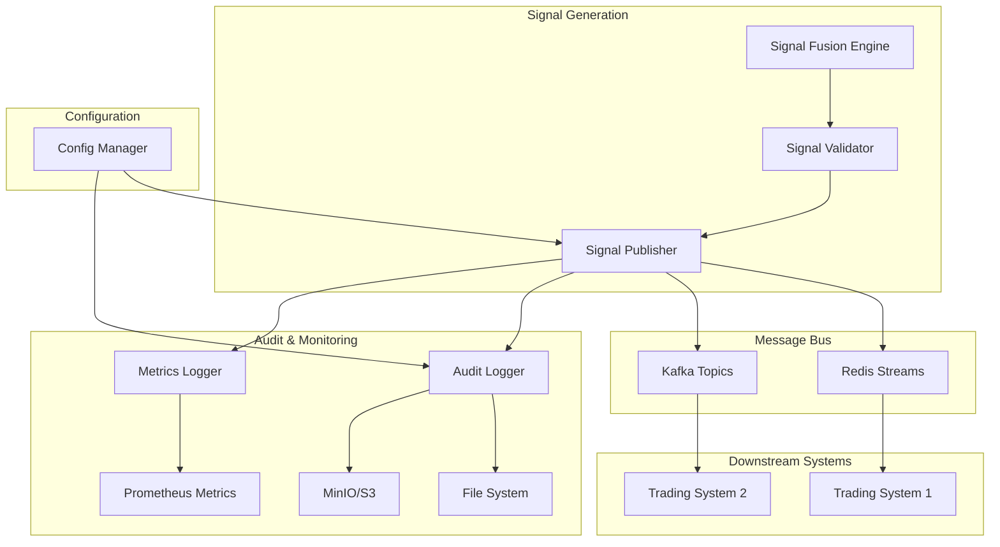
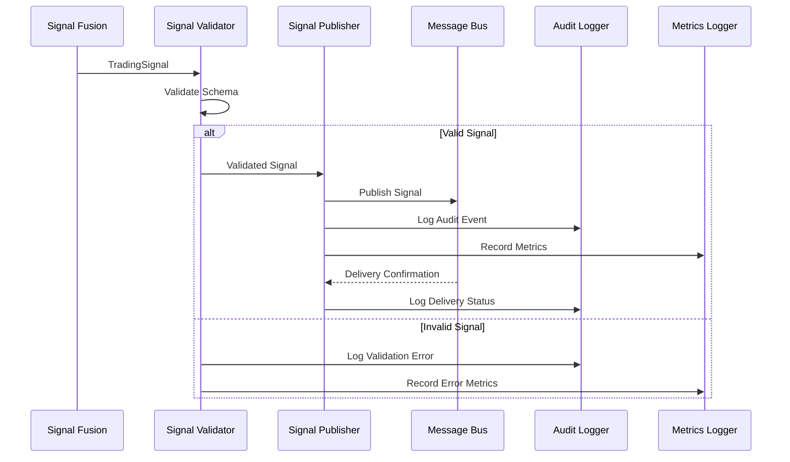

# Signal Emission Design Document

## Overview

The Signal Emission system is the final stage of the IMP trading system pipeline, responsible for publishing validated trading signals to message bus infrastructure (Redis Streams/Kafka) and maintaining comprehensive audit trails. The system integrates with the existing signal-fusion crate to provide reliable, monitored signal distribution to downstream trading systems.

## Architecture

### High-Level Architecture



### Component Interaction Flow



## Components and Interfaces

### 1. Signal Publisher (`SignalPublisher`)

**Responsibility**: Core component that publishes validated signals to message bus infrastructure.

```rust
pub struct SignalPublisher {
    redis_client: Option<RedisClient>,
    kafka_producer: Option<KafkaProducer>,
    config: PublisherConfig,
    buffer: SignalBuffer,
    metrics: MetricsCollector,
    audit_logger: AuditLogger,
}

impl SignalPublisher {
    pub async fn new(config: PublisherConfig) -> Result<Self>;
    pub async fn publish_signal(&mut self, signal: TradingSignal) -> Result<PublishResult>;
    pub async fn health_check(&self) -> HealthStatus;
    pub fn get_metrics(&self) -> PublisherMetrics;
}
```

**Key Features**:
- Dual Redis/Kafka support with configurable backends
- Automatic retry with exponential backoff
- Circuit breaker pattern for resilience
- Local buffering during outages
- Delivery confirmation tracking

### 2. Signal Validator (`SignalValidator`)

**Responsibility**: Validates signal structure and content against defined schema.

```rust
pub struct SignalValidator {
    schema: SignalSchema,
    audit_logger: AuditLogger,
}

impl SignalValidator {
    pub fn new(schema: SignalSchema, audit_logger: AuditLogger) -> Self;
    pub fn validate(&self, signal: &TradingSignal) -> Result<(), ValidationError>;
    pub fn validate_components(&self, components: &SignalComponents) -> Result<()>;
    pub fn validate_weights(&self, weights: &FusionWeights) -> Result<()>;
}
```

**Validation Rules**:
- Timestamp within acceptable range (not too old/future)
- Symbol format validation (uppercase, valid characters)
- Side enum validation ("BUY", "SELL", "HOLD")
- Strength range validation (-1.0 to 1.0)
- Confidence range validation (0.0 to 1.0)
- Component signal ranges (-1.0 to 1.0)
- Weight ranges (-1.0 to 1.0)
- Model version format validation

### 3. Audit Logger (`AuditLogger`)

**Responsibility**: Comprehensive logging of all signal emission events and feature computations.

```rust
pub struct AuditLogger {
    file_appender: FileAppender,
    s3_uploader: S3Uploader,
    correlation_tracker: CorrelationTracker,
}

impl AuditLogger {
    pub fn new(config: AuditConfig) -> Result<Self>;
    pub async fn log_signal_emission(&self, event: SignalEmissionEvent) -> Result<()>;
    pub async fn log_feature_computation(&self, event: FeatureComputationEvent) -> Result<()>;
    pub async fn log_validation_error(&self, event: ValidationErrorEvent) -> Result<()>;
    pub async fn log_publisher_error(&self, event: PublisherErrorEvent) -> Result<()>;
}
```

**Audit Event Types**:
- Signal emission events (successful publications)
- Feature computation events (with checksums)
- Validation errors (with detailed context)
- Publisher errors (connection failures, retries)
- Performance metrics (latency, throughput)

### 4. Message Bus Adapters

#### Redis Streams Adapter (`RedisPublisher`)

```rust
pub struct RedisPublisher {
    client: redis::Client,
    connection_pool: ConnectionPool,
    stream_name: String,
    max_len: Option<usize>,
}

impl RedisPublisher {
    pub async fn new(config: RedisConfig) -> Result<Self>;
    pub async fn publish(&mut self, signal: &TradingSignal) -> Result<String>;
    pub async fn health_check(&self) -> Result<()>;
}
```

**Features**:
- Connection pooling for performance
- Stream trimming to prevent unbounded growth
- Automatic reconnection on failures
- Message ordering per symbol

#### Kafka Producer Adapter (`KafkaPublisher`)

```rust
pub struct KafkaPublisher {
    producer: FutureProducer,
    topic: String,
    partition_strategy: PartitionStrategy,
}

impl KafkaPublisher {
    pub async fn new(config: KafkaConfig) -> Result<Self>;
    pub async fn publish(&mut self, signal: &TradingSignal) -> Result<()>;
    pub async fn health_check(&self) -> Result<()>;
}
```

**Features**:
- Configurable partitioning (by symbol, round-robin, custom)
- Delivery confirmation callbacks
- Batch publishing for throughput
- Compression support

### 5. Signal Buffer (`SignalBuffer`)

**Responsibility**: Local buffering during message bus outages.

```rust
pub struct SignalBuffer {
    buffer: VecDeque<BufferedSignal>,
    max_size: usize,
    persistence: Option<BufferPersistence>,
}

impl SignalBuffer {
    pub fn new(config: BufferConfig) -> Self;
    pub fn push(&mut self, signal: TradingSignal) -> Result<()>;
    pub fn pop(&mut self) -> Option<BufferedSignal>;
    pub fn len(&self) -> usize;
    pub fn is_full(&self) -> bool;
    pub async fn persist(&self) -> Result<()>;
    pub async fn restore(&mut self) -> Result<()>;
}
```

**Features**:
- Configurable size limits
- Optional disk persistence
- FIFO ordering
- Overflow handling strategies

## Data Models

### Enhanced Trading Signal Schema

```rust
#[derive(Debug, Clone, Serialize, Deserialize)]
pub struct TradingSignal {
    // Core signal data
    pub timestamp: i64,
    pub symbol: String,
    pub side: SignalSide,
    pub strength: f32,
    pub confidence: f32,
    
    // Signal components
    pub components: SignalComponents,
    pub weights: FusionWeights,
    
    // Metadata
    pub model_version: String,
    pub correlation_id: String,
    pub feature_checksum: String,
    
    // Audit fields
    pub generation_latency_ms: u64,
    pub hmm_state_probabilities: Option<Vec<f32>>,
    pub fallback_used: bool,
}

#[derive(Debug, Clone, Serialize, Deserialize)]
pub enum SignalSide {
    Buy,
    Sell,
    Hold,
}
```

### Audit Event Schemas

```rust
#[derive(Debug, Serialize, Deserialize)]
pub struct SignalEmissionEvent {
    pub event_id: String,
    pub timestamp: i64,
    pub correlation_id: String,
    pub signal: TradingSignal,
    pub publisher_backend: String,
    pub delivery_latency_ms: u64,
    pub retry_count: u32,
    pub success: bool,
    pub error_message: Option<String>,
}

#[derive(Debug, Serialize, Deserialize)]
pub struct FeatureComputationEvent {
    pub event_id: String,
    pub timestamp: i64,
    pub correlation_id: String,
    pub symbol: String,
    pub feature_names: Vec<String>,
    pub computation_latency_ms: u64,
    pub input_checksum: String,
    pub output_checksum: String,
    pub validation_passed: bool,
}

#[derive(Debug, Serialize, Deserialize)]
pub struct ValidationErrorEvent {
    pub event_id: String,
    pub timestamp: i64,
    pub correlation_id: String,
    pub signal_partial: serde_json::Value,
    pub validation_errors: Vec<ValidationError>,
    pub error_context: String,
}
```

## Error Handling

### Error Types

```rust
#[derive(Debug, thiserror::Error)]
pub enum SignalEmissionError {
    #[error("Signal validation failed: {0}")]
    ValidationError(#[from] ValidationError),
    
    #[error("Publisher error: {0}")]
    PublisherError(String),
    
    #[error("Redis connection error: {0}")]
    RedisError(#[from] redis::RedisError),
    
    #[error("Kafka error: {0}")]
    KafkaError(#[from] rdkafka::error::KafkaError),
    
    #[error("Buffer overflow: max size {max_size} exceeded")]
    BufferOverflow { max_size: usize },
    
    #[error("Configuration error: {0}")]
    ConfigError(String),
    
    #[error("Audit logging error: {0}")]
    AuditError(String),
}
```

### Circuit Breaker Pattern

```rust
pub struct CircuitBreaker {
    state: CircuitState,
    failure_count: u32,
    failure_threshold: u32,
    timeout: Duration,
    last_failure_time: Option<Instant>,
}

#[derive(Debug, Clone)]
pub enum CircuitState {
    Closed,
    Open,
    HalfOpen,
}
```

### Retry Strategy

```rust
pub struct RetryPolicy {
    pub max_attempts: u32,
    pub base_delay: Duration,
    pub max_delay: Duration,
    pub backoff_multiplier: f64,
    pub jitter: bool,
}
```

## Testing Strategy

### Unit Tests

1. **Signal Validation Tests**
   - Valid signal acceptance
   - Invalid field rejection
   - Boundary value testing
   - Schema compliance verification

2. **Publisher Logic Tests**
   - Message formatting
   - Retry mechanism
   - Circuit breaker behavior
   - Buffer management

3. **Audit Logger Tests**
   - Event serialization
   - File writing
   - S3 upload simulation
   - Correlation ID tracking

### Integration Tests

1. **Redis Integration**
   - Connection establishment
   - Stream publishing
   - Error handling
   - Reconnection logic

2. **Kafka Integration**
   - Producer configuration
   - Topic publishing
   - Partition strategy
   - Delivery confirmation

3. **End-to-End Tests**
   - Complete signal flow
   - Failure scenario handling
   - Performance benchmarks
   - Audit trail verification

### Performance Tests

1. **Throughput Testing**
   - Signals per second capacity
   - Memory usage under load
   - CPU utilization patterns
   - Network bandwidth usage

2. **Latency Testing**
   - Signal emission latency
   - Validation overhead
   - Audit logging impact
   - Buffer operations

## Configuration Management

### Configuration Structure

```rust
#[derive(Debug, Clone, Serialize, Deserialize)]
pub struct SignalEmissionConfig {
    pub publisher: PublisherConfig,
    pub redis: Option<RedisConfig>,
    pub kafka: Option<KafkaConfig>,
    pub buffer: BufferConfig,
    pub audit: AuditConfig,
    pub validation: ValidationConfig,
    pub monitoring: MonitoringConfig,
}

#[derive(Debug, Clone, Serialize, Deserialize)]
pub struct PublisherConfig {
    pub enabled: bool,
    pub backend: PublisherBackend,
    pub retry_policy: RetryPolicy,
    pub circuit_breaker: CircuitBreakerConfig,
    pub batch_size: usize,
    pub flush_interval_ms: u64,
}

#[derive(Debug, Clone, Serialize, Deserialize)]
pub enum PublisherBackend {
    Redis,
    Kafka,
    Both,
    None, // For testing
}
```

### Environment Variable Support

```bash
# Publisher configuration
SIGNAL_PUBLISHER_ENABLED=true
SIGNAL_PUBLISHER_BACKEND=redis
SIGNAL_PUBLISHER_BATCH_SIZE=100
SIGNAL_PUBLISHER_FLUSH_INTERVAL_MS=1000

# Redis configuration
REDIS_URL=redis://localhost:6379
REDIS_STREAM_NAME=trading_signals
REDIS_MAX_STREAM_LENGTH=10000
REDIS_CONNECTION_POOL_SIZE=10

# Kafka configuration
KAFKA_BROKERS=localhost:9092
KAFKA_TOPIC=trading_signals
KAFKA_PARTITION_STRATEGY=symbol
KAFKA_COMPRESSION=gzip

# Buffer configuration
SIGNAL_BUFFER_MAX_SIZE=1000
SIGNAL_BUFFER_PERSIST_TO_DISK=true
SIGNAL_BUFFER_PERSIST_PATH=/tmp/signal_buffer

# Audit configuration
AUDIT_ENABLED=true
AUDIT_FILE_PATH=/var/log/imp/signals.jsonl
AUDIT_S3_BUCKET=imp-audit-logs
AUDIT_S3_PREFIX=signals/
AUDIT_UPLOAD_INTERVAL_SEC=300
```

## Monitoring and Observability

### Prometheus Metrics

```rust
pub struct SignalEmissionMetrics {
    // Counters
    pub signals_published_total: Counter,
    pub signals_validation_errors_total: Counter,
    pub publisher_errors_total: Counter,
    pub buffer_overflows_total: Counter,
    
    // Histograms
    pub signal_emission_duration_seconds: Histogram,
    pub signal_validation_duration_seconds: Histogram,
    pub buffer_size: Histogram,
    
    // Gauges
    pub active_connections: Gauge,
    pub buffer_utilization: Gauge,
    pub circuit_breaker_state: Gauge,
}
```

### Health Check Endpoints

```rust
#[derive(Debug, Serialize)]
pub struct HealthStatus {
    pub status: ServiceStatus,
    pub timestamp: i64,
    pub components: HashMap<String, ComponentHealth>,
    pub metrics: HealthMetrics,
}

#[derive(Debug, Serialize)]
pub enum ServiceStatus {
    Healthy,
    Degraded,
    Unhealthy,
}

#[derive(Debug, Serialize)]
pub struct ComponentHealth {
    pub status: ServiceStatus,
    pub last_check: i64,
    pub error_message: Option<String>,
    pub response_time_ms: u64,
}
```

### Logging Structure

```rust
// Structured logging with correlation IDs
info!(
    correlation_id = %correlation_id,
    symbol = %signal.symbol,
    side = %signal.side,
    strength = %signal.strength,
    latency_ms = %latency,
    "Signal published successfully"
);

error!(
    correlation_id = %correlation_id,
    error = %error,
    retry_count = %retry_count,
    "Signal publication failed"
);
```

## Security Considerations

### Authentication and Authorization

1. **Redis Authentication**
   - Password-based authentication
   - TLS encryption for connections
   - ACL support for fine-grained permissions

2. **Kafka Security**
   - SASL authentication (PLAIN, SCRAM, GSSAPI)
   - SSL/TLS encryption
   - ACL-based topic access control

### Data Protection

1. **Signal Data Encryption**
   - Optional field-level encryption for sensitive data
   - TLS for all network communications
   - Secure credential storage

2. **Audit Log Security**
   - Tamper-evident logging
   - Secure S3 bucket policies
   - Log integrity verification

## Deployment Considerations

### Container Configuration

```dockerfile
# Signal emission service
FROM rust:1.70-slim as builder
WORKDIR /app
COPY . .
RUN cargo build --release --bin signal-emission-service

FROM debian:bookworm-slim
RUN apt-get update && apt-get install -y ca-certificates && rm -rf /var/lib/apt/lists/*
COPY --from=builder /app/target/release/signal-emission-service /usr/local/bin/
EXPOSE 8080
CMD ["signal-emission-service"]
```

### Kubernetes Deployment

```yaml
apiVersion: apps/v1
kind: Deployment
metadata:
  name: signal-emission-service
spec:
  replicas: 3
  selector:
    matchLabels:
      app: signal-emission-service
  template:
    metadata:
      labels:
        app: signal-emission-service
    spec:
      containers:
      - name: signal-emission
        image: imp/signal-emission:latest
        ports:
        - containerPort: 8080
        env:
        - name: REDIS_URL
          valueFrom:
            secretKeyRef:
              name: redis-credentials
              key: url
        resources:
          requests:
            memory: "256Mi"
            cpu: "250m"
          limits:
            memory: "512Mi"
            cpu: "500m"
```

### Scaling Considerations

1. **Horizontal Scaling**
   - Stateless service design
   - Load balancing across instances
   - Shared Redis/Kafka infrastructure

2. **Performance Optimization**
   - Connection pooling
   - Batch processing
   - Async I/O operations
   - Memory-efficient buffering

This design provides a robust, scalable, and maintainable signal emission system that integrates seamlessly with the existing IMP architecture while providing comprehensive audit trails and monitoring capabilities.