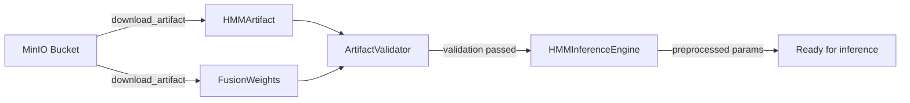

# HMM Microservice

FastAPI-based microservice for Hidden Markov Model inference in the IMP trading system.

> Current-state note: this service should be treated as a runnable service prototype, not proof that the whole repository is production-ready. See `../../docs/implementation-status.md` and `../../docs/runtime-truth.md` for repo-wide truth.

## Overview

The HMM Microservice provides REST endpoints for:
- State probability calculation from observation vectors
- Fusion weight computation for regime-aware signal combination
- Model management and hot-reloading
- Health checks and monitoring

## Quick Start

### Local Development

1. **Install dependencies:**
   ```bash
   pip install -r requirements.txt
   ```

2. **Set up environment:**
   ```bash
   cp .env.example .env
   # Edit .env with your configuration (particularly MinIO credentials)
   ```

3. **Start the service:**
   ```bash
   uvicorn app:app --reload --host 0.0.0.0 --port 8000
   ```

4. **Access the API:**
   - API Documentation: http://localhost:8000/docs
   - Health Check: http://localhost:8000/health

### Docker Development

1. **Start with Docker Compose:**
   ```bash
   docker-compose up -d
   ```

2. **Access services:**
   - HMM Service: http://localhost:8000
   - MinIO Console: http://localhost:9001 (admin/admin123)

## Canonical Service Startup

The service follows a documented initialization sequence when it starts:

1. **Logging configuration** — structured JSON logging is initialized based on `HMM_LOG_LEVEL`
2. **Performance manager** — connection pooling and concurrency limits are configured
3. **Cache manager** — inference result caching is initialized (`HMM_CACHE_SIZE`, `HMM_CACHE_TTL`)
4. **Model loader** — connects to MinIO (via `MINIO_ENDPOINT`, `MINIO_ACCESS_KEY`, `MINIO_SECRET_KEY`), sets up circuit breaker and fallback model
5. **Default model load** — loads the model specified by `HMM_DEFAULT_EXPERIMENT_ID` from MinIO, or falls back gracefully
6. **Inference engine** — receives the loaded model, preprocesses parameters (precomputes inverse covariances and log-determinants for fast inference)
7. **Ready** — service accepts requests at `/inference/*`, `/health/*`, `/models/*`

```bash
# Environment variables that control startup behavior
HMM_DEFAULT_EXPERIMENT_ID=production_hmm     # Model to load on startup
MINIO_ENDPOINT=localhost:9000                  # Where artifacts are stored
MINIO_ACCESS_KEY=minioadmin                    # MinIO credentials
MINIO_SECRET_KEY=minioadmin123
HMM_MODEL_RELOAD_INTERVAL=300                  # Seconds between update checks
```

## Canonical Artifact-Loading Path

Models are stored in MinIO and loaded through a documented pipeline:



**Step-by-step flow:**

1. `MinIOArtifactStore` connects to MinIO and downloads the artifact for a given `experiment_id` and `version`
2. `HMMArtifact(**artifact_data["hmm_artifact"])` reconstructs the Pydantic model with transition matrix, means, covariances, etc.
3. `FusionWeights(**artifact_data["fusion_weights"])` reconstructs per-state fusion weights (optional)
4. `ArtifactValidator.run_all_validations()` checks structural integrity (state count consistency, probability validity, covariance positive-definiteness)
5. `HMMInferenceEngine.load_model()` preprocesses parameters:
   - Converts transition matrix, means, covariances to numpy arrays
   - Precomputes inverse covariances and log-determinants for O(n) likelihood computation
   - Stores previous model as fallback
6. Model is ready to serve inference requests

The artifact interface (`HMMArtifact` fields: `version`, `n_states`, `transition_matrix`, `initial_probabilities`, `means`, `covariances`, `training_window_start/end`, `metadata`) is compatible with the Rust `signal-fusion` crate's `FusionWeights` struct, which expects flat `{w_ldc, w_mr, w_tsmom}` keys matching the service API response format.

```bash
# Example: loading a model via the API
curl -X POST http://localhost:8000/models/reload \
  -H "Content-Type: application/json" \
  -d '{"experiment_id": "production_hmm", "version": "latest"}'
```

## API Endpoints

### Inference Endpoints

- `POST /inference/state-probabilities` - Calculate HMM state probabilities
- `POST /inference/fusion-weights` - Calculate fusion weights
- `POST /inference/predict` - Complete prediction with state probabilities and weights

### Health Endpoints

- `GET /health` - Basic health check
- `GET /health/ready` - Readiness check for orchestration
- `GET /health/detailed` - Detailed health and system information

### Model Management

- `POST /models/reload` - Hot-reload HMM model
- `GET /models/current` - Get current model information
- `GET /models/available` - List available models

## Configuration

The service is configured through environment variables. See `.env.example` for all available options.

### Key Configuration Options

- `HMM_SERVICE_HOST` - Service bind address (default: 0.0.0.0)
- `HMM_SERVICE_PORT` - Service port (default: 8000)
- `HMM_LOG_LEVEL` - Logging level (default: INFO)
- `MINIO_ENDPOINT` - MinIO server endpoint
- `HMM_CACHE_SIZE` - Cache size limit (default: 1000)
- `HMM_MAX_CONCURRENT_REQUESTS` - Concurrent request limit (default: 100)

## Development

### Project Structure

```
hmm_service/
├── app.py                 # FastAPI application
├── core/                  # Core modules
│   ├── config.py         # Configuration management
│   ├── dependencies.py   # Dependency injection
│   ├── logging_config.py # Logging setup
│   ├── inference_engine.py # HMM inference (task 2)
│   ├── model_loader.py   # Model loading (task 2)
│   ├── cache.py          # Caching (task 4)
│   └── metrics.py        # Metrics (task 5)
├── routers/              # API routers
│   ├── inference.py      # Inference endpoints
│   ├── health.py         # Health endpoints
│   └── models.py         # Model management
├── requirements.txt      # Python dependencies
├── Dockerfile           # Container configuration
└── docker-compose.yml   # Local development setup
```

### Running Tests

```bash
# Install test dependencies
pip install -r requirements.txt

# Run tests
pytest

# Run with coverage
pytest --cov=hmm_service
```

### Code Quality

```bash
# Format code
black .
isort .

# Lint code
flake8 .
mypy .
```

## Performance Targets

- **Inference Latency**: <20ms p95
- **Throughput**: 100+ requests/second
- **Memory Usage**: <512MB under normal load
- **Availability**: 99.9% uptime

## Monitoring

The service exposes Prometheus metrics at `/metrics` including:
- Request counts and latency
- Model loading and inference metrics
- Cache hit rates
- System resource usage

## Security

- Input validation on all endpoints
- Request rate limiting
- CORS configuration
- Optional API key authentication (future)

## Deployment

### Production Deployment

1. **Build container:**
   ```bash
   docker build -t hmm-service:latest .
   ```

2. **Deploy with environment variables:**
   ```bash
   docker run -d \
     -p 8000:8000 \
     -e MINIO_ENDPOINT=your-minio-endpoint \
     -e MINIO_ACCESS_KEY=your-access-key \
     -e MINIO_SECRET_KEY=your-secret-key \
     hmm-service:latest
   ```

### Health Checks

Configure your orchestrator to use:
- **Liveness**: `GET /health`
- **Readiness**: `GET /health/ready`

## Troubleshooting

### Common Issues

1. **Model loading fails**: Check MinIO connectivity and credentials
2. **High latency**: Check cache configuration and model size
3. **Memory issues**: Adjust cache size and concurrent request limits

### Logs

The service uses structured JSON logging. Key log fields:
- `request_id` - Unique request identifier
- `processing_time_ms` - Request processing time
- `endpoint` - API endpoint called
- `error` - Error details if applicable

## Integration

### Rust Client Example

```rust
use reqwest::Client;
use serde_json::json;

let client = Client::new();
let response = client
    .post("http://hmm-service:8000/inference/predict")
    .json(&json!({
        "observations": [0.1, -0.2, 0.3],
        "timestamp": 1234567890
    }))
    .send()
    .await?;
```

## License

Part of the IMP trading system. See main repository for license information.